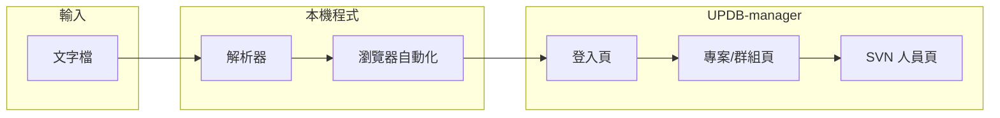

# UPDB-manager 依文字檔批次加入專案成員 — 實作方案

## 需求整理

- **輸入**：文字檔，每行一筆。格式為：
  - **第一欄（Tab 前）**：`{Project} {Group} [SVN] RT`（空白分隔）。例如 `RL6665 Digital SVN RT` → 專案 `RL6665`、群組 `Digital`、要加 SVN 權限。
  - **第二欄（Tab 後）**：工號，例如 `R8943`。其餘欄位（姓名、分機、部門、Email）不使用。
- **行為**：在 UPDB-manager 網頁中選定專案 → 在指定群組加入該工號；若該行有 `SVN`，再從 UPDB-manager 點擊進入另一頁面，於該頁面加入 SVN 人員（同樣用工號）。
- **登入**：程式只負責開啟瀏覽器並打開 UPDB-manager，由使用者手動完成手機 OTP 登入，登入後程式再自動執行上述操作。

---

## 架構概觀



- **解析器**：讀取文字檔，輸出結構化資料（專案、群組、是否要 SVN、工號）。
- **瀏覽器自動化**：使用 Playwright 控制瀏覽器，先打開登入頁，等使用者 OTP 完成後，依解析結果在「專案/群組頁」與「SVN 頁」操作。

---

## 1. 文字檔解析

- **格式規則**：
  - 以 **Tab** 區隔「第一欄」與「第二欄」；第二欄即工號。
  - 第一欄以 **空白** 分割為多個 token：`[Project] [Group] [SVN?] [RT]`。
    - 第 1 個：專案名稱（如 `RL6665`）。
    - 第 2 個：群組名稱（如 `Digital`、`Analog`）。
    - 若出現 `SVN`：該筆要一併加入 SVN 權限。
    - `RT` 與其餘 token 忽略。
- **輸出結構**：每筆為一筆紀錄，例如 `{ project, group, addSvn: boolean, employeeId }`。空行或無法解析的行可跳過並寫入 log。
- **實作**：獨立模組（例如 `parser.py` 或 `parser.js`），可單元測試，方便之後調整格式。

---

## 2. 技術選型：Playwright + Python 或 Node.js

- **Playwright**：支援 Chromium/Firefox，可保留有頭瀏覽器讓您看到操作與手動 OTP，穩定性與選擇器支援佳。
- **語言**：
  - **Python**：多數公司環境易安裝、易維護，建議用 **Python + Playwright**。
  - 若團隊以 Node.js 為主，可改為 **Node.js + Playwright**。
- 本方案以 **Python** 為預設，以下皆以 Python 撰寫為例。

---

## 3. 程式流程（高層）

1. **讀取設定**：UPDB-manager 登入頁 URL、文字檔路徑（可從指令列參數或設定檔讀取）。
2. **解析文字檔**：呼叫解析器，得到 `List[Record]`。
3. **啟動瀏覽器**：Playwright 啟動 Chromium，**有頭模式**（非 headless），開啟 UPDB-manager 登入頁。
4. **等待登入**：程式偵測「已登入」狀態（例如登入後會出現的 URL 或頁面元素），或提供簡單按鍵（例如在終端輸入 Enter）後才繼續，避免在未登入時操作。
5. **依序處理每筆紀錄**：
   - 在 UPDB-manager 中 **選擇專案**（依實際 UI：下拉選單、連結或搜尋）。
   - 在該專案下 **選擇/進入指定群組**（如 Digital、Analog）。
   - **新增成員**：輸入工號並確認加入。
   - 若該筆 `addSvn == True`：**從目前頁面點擊進入 SVN 人員管理頁**，在該頁面 **以工號新增 SVN 人員**，完成後返回（依實際 UI 決定是否需返回專案列表）。
6. **結束**：關閉瀏覽器或保留開啟供檢查，並輸出簡單報告（成功/失敗筆數、失敗行號或工號）。

---

## 4. 專案結構建議

```
UPDV_SVN_autoupdate/
├── config.yaml or .env          # UPDB 登入頁 URL、文字檔預設路徑等
├── requirements.txt             # python, playwright
├── main.py                      # 流程：解析 → 啟動瀏覽器 → 等待登入 → 迴圈操作
├── parser.py                    # 文字檔解析，回傳 List[Record]
├── browser_ops.py               # Playwright 操作：選專案、加群組成員、進 SVN 頁加人
├── (optional) selectors.yaml    # 依實際網頁可調整的 CSS/XPath，方便維護
└── README.md                    # 使用方式、文字檔格式、依賴安裝
```

- **selectors**：UPDB-manager 與 SVN 頁的按鈕、輸入框、下拉選單等，因實際 HTML 未可知，建議集中放在設定或 `selectors.yaml`，之後依真實網頁再填一次即可。

---

## 5. 需您事後提供的資訊（選項與設定）

- **UPDB-manager 登入頁 URL**（例如 `https://updb-manager.xxx.company/...`）。
- **登入後的「首頁」或「專案列表」**：如何判斷「已登入」可開始操作（URL 變化或某個元素出現）。
- **選擇專案的方式**：下拉、連結、搜尋框等。
- **選擇群組的方式**：例如同一專案下有多個群組（Digital、Analog），UI 如何切換或點選。
- **新增專案成員的步驟**：按鈕文字、是否要選群組再輸入工號、確認按鈕等。
- **從 UPDB-manager 進入「SVN 人員頁」的方式**：例如某個「SVN 權限」或「SVN 人員管理」連結/按鈕。
- **SVN 頁面新增人員的步驟**：輸入工號的欄位、送出按鈕等。

以上可在程式骨架完成後，由您提供實際網頁截圖或 HTML 結構，再填入 `browser_ops.py` 與選擇器設定。

---

## 6. 錯誤處理與日誌

- **解析階段**：無法解析的行寫入 log，並可選擇跳過或中斷。
- **操作階段**：若某筆「選不到專案」、「加人失敗」、「SVN 頁加人失敗」，記錄該筆（專案、工號、步驟），可選擇繼續下一筆或中斷。
- 日誌建議包含：時間、步驟、成功/失敗、錯誤訊息，方便排查。

---

## 7. 實作順序建議

| 步驟 | 內容 |
|------|------|
| 1 | 建立專案目錄、`requirements.txt`、`config` 骨架 |
| 2 | 實作 `parser`：讀檔、依 Tab/空白解析、回傳 `List[Record]`，並寫簡單單元測試 |
| 3 | 實作 `main.py`：啟動 Playwright、開登入頁、等待登入（以「按 Enter 繼續」或簡單 URL/元素偵測） |
| 4 | 實作 `browser_ops.py` 骨架：選專案、加群組成員、進 SVN 頁、SVN 加人（先以 placeholder 選擇器或註解標註待填） |
| 5 | 串接：main 讀取文字檔 → 解析 → 依序呼叫 browser_ops，並加上日誌與錯誤處理 |
| 6 | 您提供實際 UPDB-manager / SVN 頁面結構後，補齊選擇器與操作細節，並做一次端對端測試 |

---

## 8. 風險與注意事項

- **UI 變更**：UPDB-manager 或 SVN 頁改版會導致選擇器失效，建議選擇器集中管理，並在 README 註明「若網頁改版需更新選擇器」。
- **OTP 逾時**：若登入後閒置過久 session 過期，程式可偵測到被導回登入頁時提示重新登入（或重新等待 OTP）。
- **重複執行**：若同一工號已在專案/群組或 SVN 中，需確認實際網頁是顯示錯誤或自動忽略，必要時在程式中做「已存在則跳過」的處理。
- **文字檔編碼**：建議統一使用 UTF-8，解析時明確指定編碼，避免中文姓名欄位造成亂碼或解析錯誤。

---

## 小結

- **輸入**：依您給的文字檔格式解析出「專案、群組、是否 SVN、工號」。
- **執行**：Playwright 有頭模式開啟 UPDB-manager → 您手動完成 OTP 登入 → 程式依解析結果在專案/群組頁加人，並在需要時跳轉 SVN 頁加人。
- **產出**：可執行的 Python 專案骨架、解析器、以及預留好「選專案 / 加群組 / 進 SVN 頁 / SVN 加人」的瀏覽器操作模組，待您提供實際頁面資訊後補齊選擇器即可上線使用。

若你希望改為 **Node.js** 或要加上「從設定檔讀取預設文字檔路徑」、「支援多個文字檔」等，可再調整方案細節。
